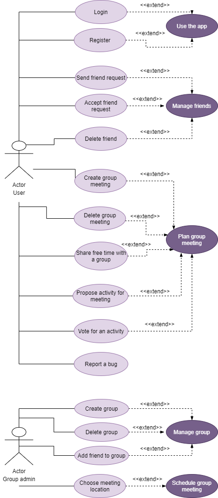

# FriendSync App

## Authors:
- Ana-Maria Comorasu
- Daniel Avram
- Laura-Maria Tender
- Nicolae Ducal

## App Description and Features
- Find the perfect time to meet your friends and pick an activity based on your schedule and preferences.
- Login with e-mail and password.
- Users can add friends by their e-mail or username.
- Users can create friend groups and group meetings. 
- A meeting can take place in a set time interval (e.g. 01/03 - 08/03) and the group members can choose dates and times when they are available in that interval.
- Group members can propose activities or choose from those proposed by others.
- Following their preferences, the app will suggest the best time interval, location and activity for the meeting.
- 60 minutes before the meeting, the members of the group will see on their maps the location where they should arrive and other members' locations.

# Technologies
- **React Native** for frontend
- **Express** for backend
- **JavaScript**
- **Firebase** for the database and authentification

# UML Use Case Diagram

# Project Checklist
- user stories, backlog creation - 2 pct ✅ Can be found [here](https://github.com/DreamUnibucTeam/FriendSync/projects/1).
- design/architecture/UML - 2 pct ✅ Diagram can be found at the following [link](https://github.com/DreamUnibucTeam/FriendSync/tree/main/UML/uml.pdf).
- source control (branch creation, merge/rebase, minim 10 commits) - 2 pct ✅ ~70 commits in more than 20 branches
- automatic testing (unit or integration) - 8 unit tests that can be found [here](https://github.com/DreamUnibucTeam/FriendSync/tree/main/server/__tests__/requests) - 3 pct ✅
- bug reporting - 1 pct ✅ users can [report bugs](https://github.com/DreamUnibucTeam/FriendSync/blob/main/server/routes/report.routes.js) with different labels which will be added to project's issues
- build tool - 1 pct ✅ (used Expo as a build tool for React Native)
- design patterns - 1 pct ✅ (used Singleton design pattern for backend controllers and functional components for React Native)